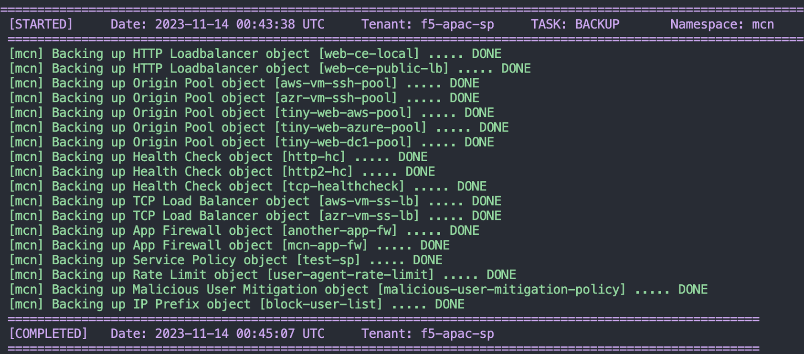
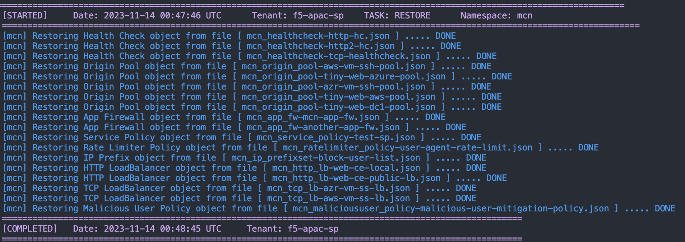
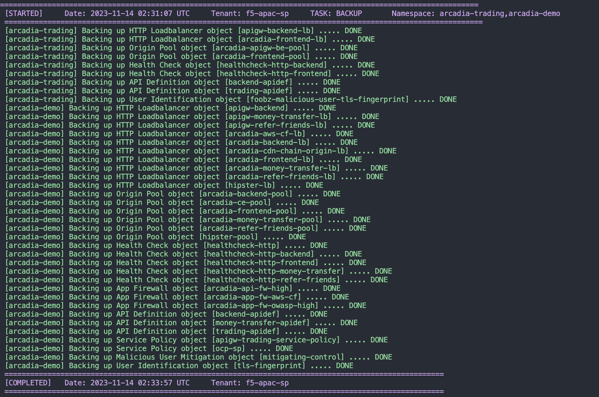
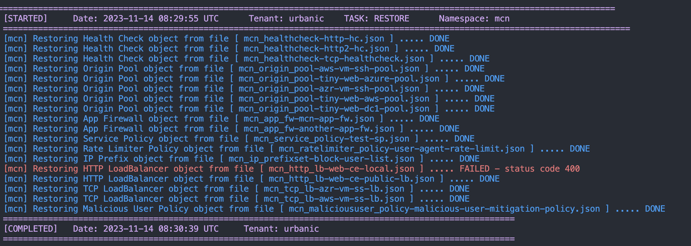
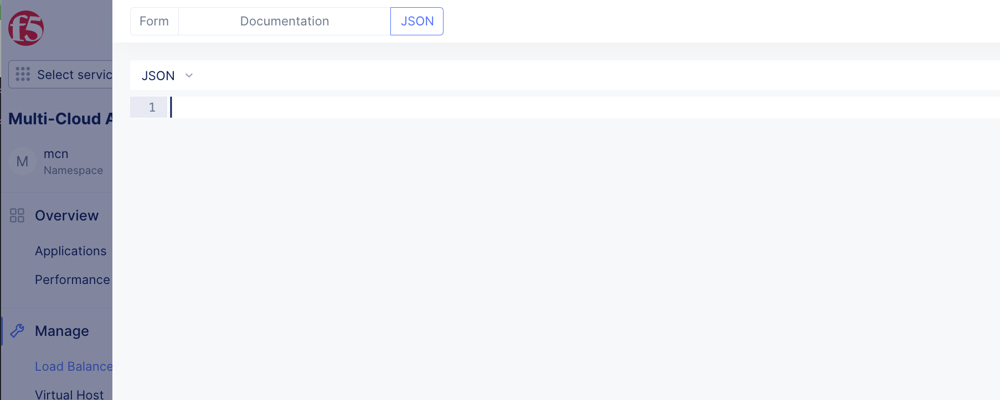
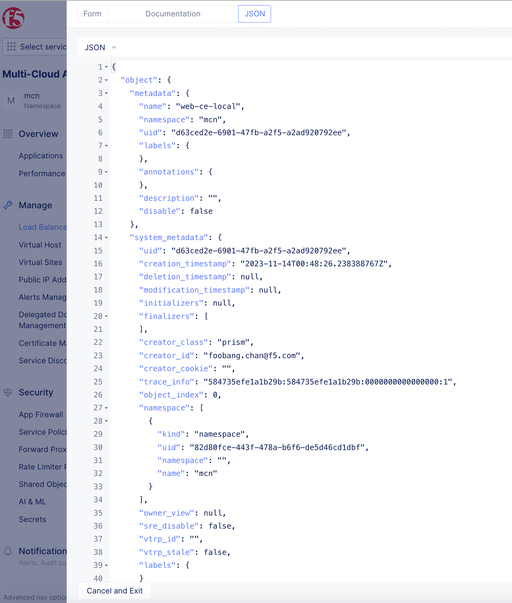
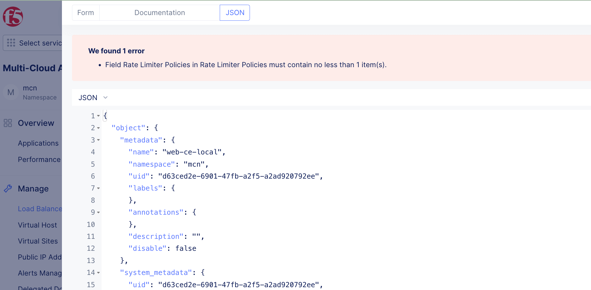
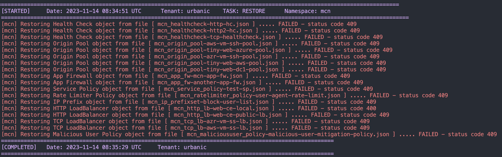

# F5XC Configuration Object Backup/Restore Utils

This script assist F5 Distributed Cloud (F5XC) administrator to simplify operation of backup and restore configuration objects from/to F5XC Portal.

**Backup Function**

* Recursively send API call (e.g. GET) to retrieve respective configuration objects and write output as JSON format into a file.

**Restore Function**

* Recursively read local backup file (JSON format) and send API call (e.g. POST) to configure and create configuration objects.

##### Note:

* Both functions above interact directly with F5XC Portal API GW.
* For restore function, it only support creation of new objects. It does not update existing objects (e.g. PUT) - "error code 409 - Conflict" will shown if object exist. Ensure objects are deleted before restore.
* Backup file will be stored on a local folder based on namespace. Each configuration objects will prefix with object type as a filename.
* Restoration will read from local folder based on namespace. Each respective configuration objects will be read based on object type filename.

### Applicable Use Cases

1. Daily/weekly or monthly configuration backup and versioning of backup to ensure it can be restored back in future.
2. What if certain configuration objects been tampered and require restoration of good configuration.
3. Before perform production changes, backup for reference or for recovery.

##### Note:

- Supported backup and restore configuration objects
  - HTTP Load Balancer
  - TCP Load Balancer
  - Origin Servers and Pools
  - Health Check
  - App Firewalls with it WAF exclusion policy
  - API Definition
  - Service Policy
  - Rate Limiter Policy
  - Malicious User Policy
  - User Identification Policy
  - IP Prefix Set
  - Forward Proxy Policy
  - Alert Policy
  - Alert Receiver
  - Global Log Receiver
  - Certificate Management
  - Certificate Management Chain
  - Service Discovery

Scripts writte in python. Please comment or uncomment respective function to perform desired outcome. Each respective function performs a single action.

##### Requirement :

* Python 3.x
* Install neccessary modules. Refer to requirements.txt
* F5XC Tenant URL
* F5XC API Token
* For restore config, ensure namespace exist prior

Please updates the tenantID and the API Key inside the python script before you run. Please refer to https://docs.cloud.f5.com/docs/how-to/user-mgmt/credentials for details to obtains an API Token.

> tenant_url = 'https://--your-tenant-id--.console.ves.volterra.io'
> api_token = 'xxxxxxx' # API token for xxxxx

Please updates the full tenantID. Example shown below. This full tenantID can be obtained from F5XC Console or obtains from sample json output. The following function will remove tenant information on the backup json file so that this backup json file can be restored on other tenant.

> in_place_remove_string(item_file, '\"tenant\": \"***f5-apac-sp-yhsgmcye***\",')

##### Few tunable knobs

* backup_wait_time - default 1s. This is the delay in seconds to avoid triggering API rate limit.
* restore_wait_time - default 2s. This is the delay in seconds to avoid triggering API rate limit as well as give enough time for F5XC to process request before subsequent POST request. Important if sequence of POST dependent on previous call.

##### Usage

> usage: f5xc-backup-restore.py [-h] --action ACTION --namespace NAMESPACE
>
> F5XC Backup/Restore Utility Usage
>
> optional arguments:
> -h, --help            show this help message and exit
>
> --action ACTION, -a ACTION
> Desire Action - backup / restore
>
> --namespace NAMESPACE, -n NAMESPACE
> Namespace - comma deliminated

Sample output

~ ./f5xc-backup-restore.py -a backup -n mcn

~ ./f5xc-backup-restore.py -a restore -n mcn

Backup more than one namespace with comma deliminated
~ ./f5xc-backup-restore.py -a backup -n arcadia-trading,arcadia-demo

**Troubleshooting**

If restore not working and return status code that is non 2xx, you can validate the issues by using F5XC Console GUI.

**Example #1**

Restore to new tenant
~ ./f5xc-backup-restore.py -a restore -n mcn

Restore return error code 400 for "web-ce-local.json". You can copy and paste content of web-ce-local.json and paste it into F5XC console to see the details of error.

Clear content of the default JSON text.

Paste content of web-ce-local.json

Details error shown why error happened. Missing required object - Rate Limiter Policies. Ensure Rate Limiter Policies restore first before restore this HTTP LB as HTTP LB reference to the rate limiter policies.

**Example #2**

Eror code 409 - Conflict. Configuration exists in the namespace.

~ ./f5xc-backup-restore.py -a restore -n mcn

